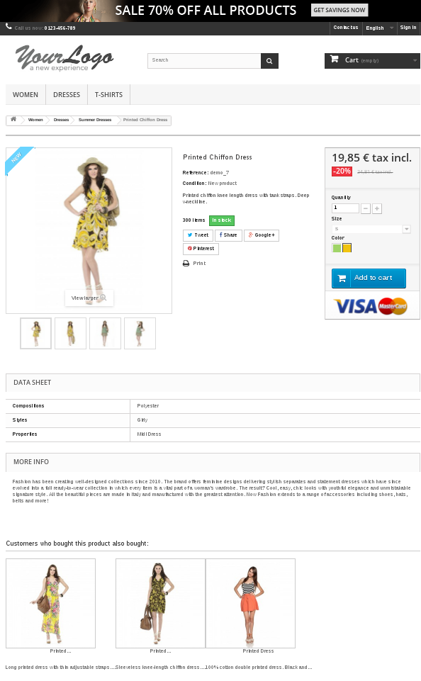

# Improved Cross-selling module for Prestashop

## About

Adds a "Customers who bought this product also bought..." section to every product page, allowing cross-sells of
frequent products that are bought together.

It is based on the popular FP-Growth pattern mining algorithm to look for solid cross-selling recommendations.

## Benefits
In 2006, Amazon CEO Jeff Bezos revealed that an incredible 35% of sales were a direct result of cross-sells.
This module is an starting point for anyone that wants to use cross-selling for increasing its revenue.

## Installation
Install as an standard Prestashop module, the installation can take a while as it creates the pattern database.

## Recommendations
* It has been tested in Prestashop v1.5 - 1.6, do not use with other versions.
* You should update the pattern database at least once a week.

## Screenshots

## Additional notes
* Cross-selling products are displayed ordered by the strength of the relation with the given product.
* More info on cross-selling: https://en.wikipedia.org/wiki/Cross-selling
* More info on Fp-Growth: 
https://en.wikibooks.org/wiki/Data_Mining_Algorithms_In_R/Frequent_Pattern_Mining/The_FP-Growth_Algorithm
